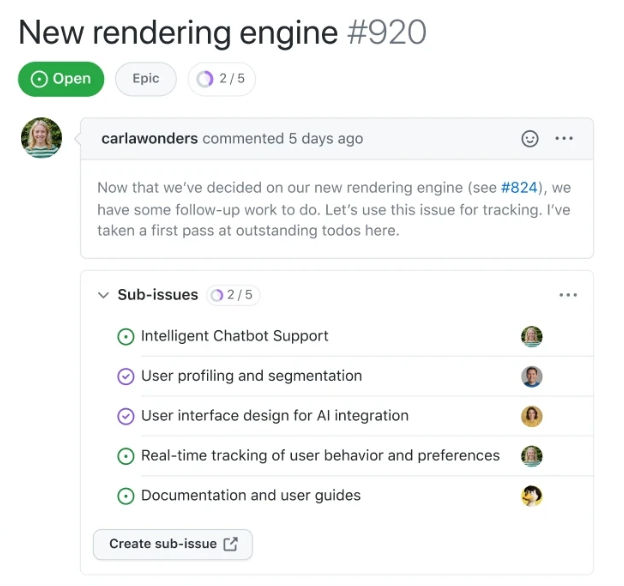
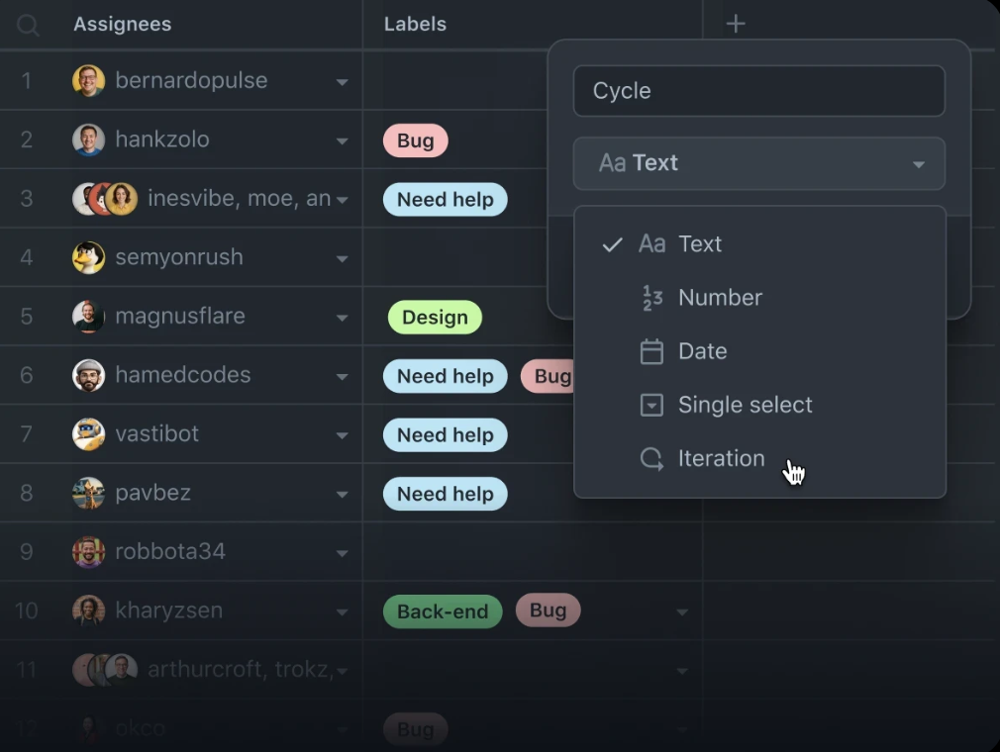
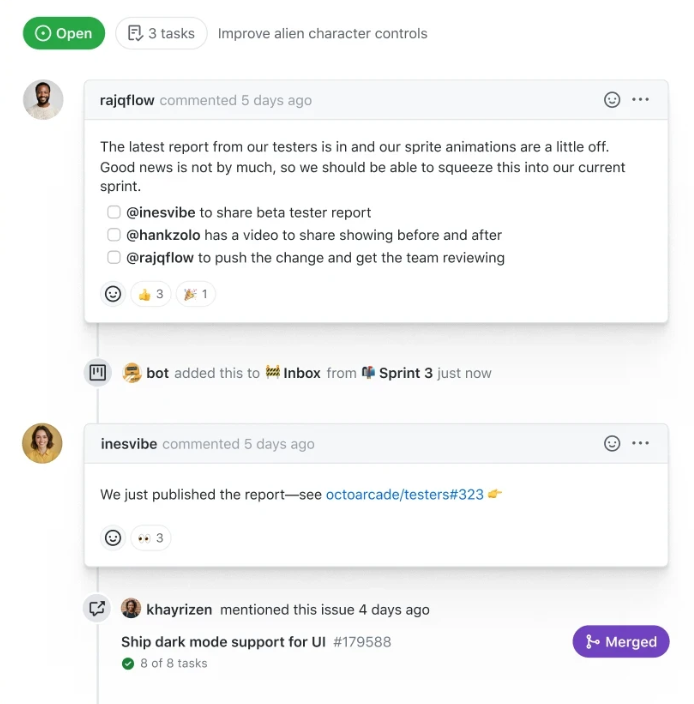
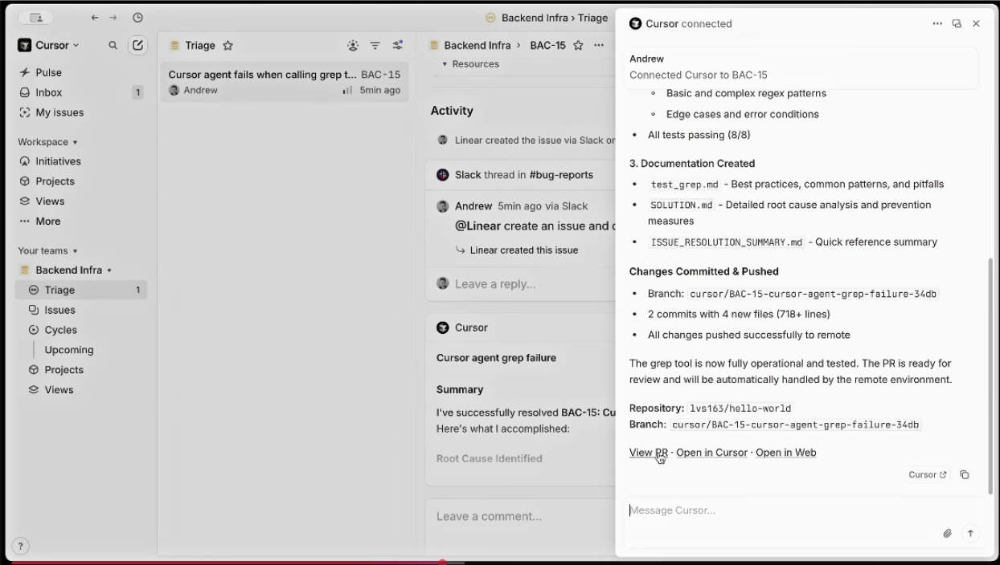

## Jira

Jira is a tool for planning, tracking, and managing work, with work items, boards, workflows, statuses, custom fields, and reporting. In Jira, work moves through workflows made of statuses and transitions, and boards visualize that work in columns tied to the workflow. Also, Jira is a broad project management and issue tracking platform for teams, while our project wants an issue tracker designed around AI workflows too: things like tracking tokens, budget, time, or different views for humans.

### Best features

- Good at tracking work: each task can have a title, details, assignee, labels, and status.
- Very customizable: teams can change workflows, issue types, and fields to fit their process.
- Good for software teams: it is built around planning, tracking, and releasing work.

### Weaknesses

- Can feel too heavy: lots of settings, fields, and screens can make it feel cluttered.
- Too much setup: strong customization is useful, but it can also make the system confusing.
- Not always best for small/simple teams: simpler tools may be easier to start with.

### What to copy

- Copy the basic issue structure: title, description, status, assignee, labels, comments.
- Copy workflow/status tracking.
- Copy board view for easy progress checking.
- Copy search/filtering so users can find work fast.

### What to avoid

- Avoid too many fields on one issue.
- Avoid making setup too complex.
- Avoid a cluttered UI.
- Avoid forcing users through too many steps just to update one task. (keep it simple)
- Avoid building a tool that only works well for humans, it should also work well for AI agents.

---

---

## GitHub Issues

GitHub Issues is a tool for developers to create project planning, manage issues, track progress, and have conversations on the same platform. It also allows developers to:

- Break issues down into **sub-issues** to tackle complex issues easily (fig. 1)
- Add **custom fields** to attach structured data to issues, such as priority level, estimated effort, story points, dates, notes, links, and any attribute relevant to the workflow (fig. 2)
- **Streamline conversation** using GitHub Flavored Markdown - mention contributors, react with emoji, clarify with attachments, and see references from commits, pull requests, releases, and deploys (fig. 3)

### Best Features

- **Sub-issues** - break complex issues into smaller, manageable tasks
- **Custom fields** - attach structured data like priority, story points (number field), dates, and notes
- **Streamlined conversation** - GitHub Flavored Markdown, emoji reactions, attachments, and automatic references from commits and pull requests
- **Multiple views** - visualize work as tables, boards, or roadmaps
- **Automation** - integrates with GitHub Actions to auto-assign issues, close tickets on PR merge, or move cards on a project board
- **Flexible access** - manage issues via web browser, mobile app, or GitHub CLI (`gh`)
- **Organization** - custom labels, assignees, and milestones (sprints, project goals) to track progress toward deadlines

### Weaknesses

- Limited hierarchy and reporting for cross-team projects
- No built-in sprint velocity tracking or burndown charts (agile reporting layer is missing)
- Weak cross-project visibility
- Interface is developer-oriented, making it less intuitive for non-technical team members
- Poor fit for complex, cross-functional workflows outside engineering
- Good for engineering teams that use GitHub, but not well-suited for non-technical or cross-functional project management

### What to Copy

- **Sub-issues** - agents can break down complex tasks, providing a structurally clear benefit for both agent and human to track progress at each step
- **Custom fields** - use fields like priority, status, estimated effort, and agent-assigned metadata so the agent can read and update structured data
- **Markdown format** - easy for both agents and humans to parse, write, and render; make it the default for all issue descriptions, comments, and logs
- **Simple label signals** - use labels like `in-progress`, `needs-review`, `blocked` to organize and filter tasks without complex logic
- **Minimal, clean interface** - keep the interface concise and structured so agent outputs are easy to interpret

### What to Avoid

- **Developer-only interface** - the tracker still needs a human to review, so the UI must be readable, intuitive, and convenient for non-technical reviewers, not just engineers
- **Weak cross-project visibility** - if the agent works across multiple tasks or projects, build a global view so humans can see everything the agent has worked on
- **No agile reporting** - include at least a simple progress view so humans can quickly track agent performance
- **Freeform or unstructured data** - unlike GitHub Issues where humans can fill in anything freely, enforce fixed schema for agent-written fields so output stays predictable and parseable

_Fig. 1 - break issues into sub-issues_

_Fig. 2 - custom fields_

_Fig. 3 - Streamline conversations_

---

---

## Linear

Linear is an online product management and issue tracking platform that recently pivoted to AI agent applications. Before this pivot, their selling point was being a Jira alternative that addressed its pain points for engineers. While Jira is full of features, this makes it slow and hard to navigate. As a result, big companies often hire people whose sole purpose is to use Jira and be Jira experts. Linear’s interface is more sparse, but much more friendly to engineers. If you want to see issues, they’re in the “Issues” panel. If you want to see full features, they’re in the “Projects” panel. Issues created by other teams are in the “Triage” panel (fig. 4). One of the new AI features included with the pivot include Linear Agent, a native AI that analyses all of your product’s information on Linear to create new projects, issues, and documents. They’ve also created the ability to convert workflows into AI skills, as well as automations to activate Linear Agent when new issues are created.

_Figure 4 - Screenshot of Linear’s interface, from the video “How Cursor uses Linear”._

_Figure 5 - The word “agent” appears on Linear’s new product page 25 times_

### Best Features:

- Clean and fast interface, which is also kept simple to make creating and reading issues efficient.
- The ability to import issues from other platforms, making it easy for teams to migrate to Linear.
- Advanced AI features
- Detailed documentation

### Weaknesses:

- Analytics: platforms like Jira can convert data into custom analytics/dashboards.Linear has some of these features, but not as much as competitors.
- Customizability: while Linear has better defaults than Jira, it lags behind in customization options, making Jira preferred for use in big companies.
- Since Linear is designed with engineers in mind, large companies with separate HR, finance, and other teams prefer alternatives that accommodate those teams.

### What to Copy:

- Minimal interface: this reduces user learning curves, improves performance, and gives our team less work to do
- Documentation: users should have easy access to relevant documentation when using our website to prevent confusion
- Agents: the Linear Agent is an example of how AI agents can be used to read through issues and give insights

### What to Avoid:

- Letting agents write too many issues: As people discussed on this Reddit thread I found, the issue of what not to build is a big challenge in project management. If - AI is not monitored, it will come up with a bunch of issues, most of which will have to be cut.
- Automations: while agent automations are nice, they’re complex and would add too much scope to our project.
